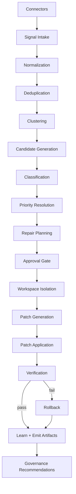
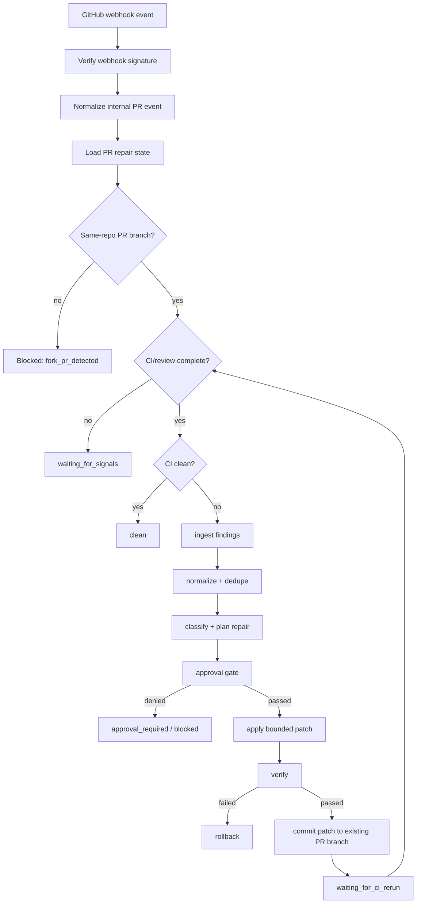

# Architecture

## Module responsibilities

- `connectors`: GitHub, CodeRabbit, Codecov, and environment boundaries.
- `ingestion`: PR and comment/tool finding intake.
- `normalization`: canonical finding shape, fingerprinting, and deduplication.
- `clustering.py`: groups related normalized findings.
- `candidates.py`: converts clustered findings into repair candidates.
- `classification`: defect taxonomy and finding classification.
- `planning`: repair plan creation and approval gate decisions.
- `governance`: canonical policy adapters for approval and protected paths.
- `workspace`: git worktree isolation, backup refs, checkout, rollback, push helpers.
- `repair`: validated implementation for patch generation, patch application, and execution.
- `patching`: canonical compatibility surface for repair operations.
- `verification`: local command execution and verification report construction.
- `learning`: pattern extraction and governance recommendation outputs.
- `output`: artifact writing and PR commentary generation.
- `artifacts`: canonical compatibility surface for artifact writing.
- `pipeline`: validated pipeline implementation.
- `orchestration`: canonical compatibility surface for pipeline orchestration.
- `runtime`: runtime package boundary.
- `rollback`: canonical compatibility surface for rollback operation.

## Connector boundaries

Connectors collect external signals. They MUST NOT apply patches, bypass policy, or mutate repository state.

## Repair lifecycle

A repair lifecycle starts with collected PR signals and ends with one of: no applicable instructions, approval required, completed, or rolled back after verification failure.

## GitHub PR Repair Loop

### New orchestration modules

- `src/pr_repair/orchestration/pr_loop.py` owns the deterministic repair loop state transitions.
- `src/pr_repair/server/github_webhook.py` verifies GitHub signatures and emits normalized internal events.
- `src/pr_repair/runtime/pr_state_store.py` persists per-PR repair state locally.
- `src/pr_repair/connectors/github_pr_branch.py` commits to existing same-repo PR branches only.

The PR loop does not create pull requests, merge pull requests, or bypass approval gates.
