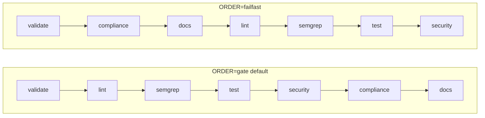

# Plan: `make pr` — full local PR pipeline (v2.1)

## Change log from v2.0

| ID | Change | Reason |
|----|--------|--------|
| C1 | Use Alpine images; ports 5433/6380 (not 5432/6379) | Avoid conflicts with dev compose stack |
| D2 | pr-quick prints skipped-phases banner | Prevent silent L9 weakening |
| D4 | Makefile delegates all logic to pr_pipeline.sh PHASE= | Zero logic duplication |
| F-note | F1 marked HIGH — only F1 closes drift permanently | F2 is nice-to-have |
| B-note | Phase functions, not subshells — stack traces survive set -e | Debuggability |
| E4 | Pointer-only in TESTING/CLAUDE/AGENTS; env var table SSOT stays AGENT.md | Avoids new duplication |
| A2 | Explicit grep -P audit step before any script is written | Portability gate-left |
| blocking | Added blocking chains between todos | Prevent out-of-order execution |

---

## First principles (unchanged — core facts)

| Type | Content |
|------|---------|
| **Truth** | No `pr` target exists; `agent-check` is 7 gates, not full CI. |
| **Truth** | `ci.yml` **ci-gate** fails only if **validate, lint, semgrep, test** fail. |
| **Truth** | `compliance.yml` and `docs-consistency.yml` are **separate** workflows but still **block PRs**. |
| **Inference** | Local `make pr` must include compliance + docs for "surprise-free PR." |
| **Constraint** | SBOM, Scorecard, dependency-review, Sonar/CodeRabbit: **cloud-only**. |
| **Constraint** | Ephemeral Postgres/Redis require Docker; no silent skip — fail fast. |

**Objective function:** Maximize P(branch passes required GitHub checks) while keeping bisect-friendly phases and zero drift between scripts and YAML.

---

## Failure modes → safeguards (updated)

| Failure | Safeguard |
|---------|-----------|
| Script ≠ YAML | **F1 (HIGH):** docs-consistency.yml calls `bash scripts/docs_consistency_local.sh` — single SSOT |
| macOS `grep -P` | **A2:** Audit all inline bash before porting; rewrite as `python3 -c` or `perl -ne` |
| No Semgrep | Fail with install hint + `PR_SKIP_SEMGREP=1` documented; never silent |
| Docker down | Fail fast with clear message; `PR_SKIP_INTEGRATION=1` is explicit escape (logged to stderr) |
| `pr-quick` abuse | **D2:** Banner on every pr-quick run: "SKIPPED PHASES: semgrep, test, security" |
| Dev port conflict | **C1:** Use ports 5433/6380 (not 5432/6379) in docker-compose.pr.yml |
| Teardown on crash | **C2:** `trap "pr_services_down" EXIT INT TERM` — teardown always fires |
| Stack trace lost in set -e subshell | **B-note:** Phase functions (not subshells) so bash ERR trap captures line numbers |

---

## Phase order (unchanged)

### ORDER=gate (default — mirrors ci.yml mental model)

```
validate → lint → semgrep → test → security → compliance → docs
```

### ORDER=failfast (cheap-first — fails before Docker)

```
validate → compliance → docs → lint → semgrep → test → security
```

**Rationale for failfast:** terminology/chassis checks (compliance) and doc consistency (docs) are Python/grep — they run in <5s with no Docker dependency. Surfacing them before the test phase (which spins Docker) saves ~2-3 min on every compliance failure.



---

## Environment variables (SSOT: AGENT.md — reference only here)

| Variable | Default | Purpose |
|----------|---------|---------|
| `ORDER` | `gate` | Phase execution order: `gate` or `failfast` |
| `COVERAGE_MIN` | `60` | pytest --cov-fail-under threshold |
| `PR_MYPY_NONBLOCKING` | unset (blocking) | `1` = mypy is warn-only, mirrors CI WAIVER-001 |
| `PR_SECURITY_STRICT` | unset (warn) | `1` = pip-audit + safety fail the pipeline |
| `PR_SKIP_SEMGREP` | unset (run) | `1` = skip with stderr banner |
| `PR_SKIP_INTEGRATION` | unset (run) | `1` = skip test phase; banner lists what is skipped |
| `PR_PYTEST_XDIST` | unset (single) | `1` = pytest -n auto (xdist must be installed) |

All variables must be documented in AGENT.md §"Permitted Commands" — not restated in TESTING/CLAUDE/AGENTS.

---

## Design decisions (v2.1 additions in **bold**)

1. **SSOT:** `scripts/pr_pipeline.sh` orchestrates; `scripts/docs_consistency_local.sh` is extracted from workflow; Makefile delegates only.
2. **Phase implementation:** Phase functions, not subshells — `phase_validate() { … }` — so `set -e` + ERR trap produce line numbers.
3. **Docker compose project:** Named `l9pr` (`-p l9pr`) so teardown is scoped and does not affect dev stack.
4. **Port offset:** postgres:16-alpine on 5433; redis:7-alpine on 6380 — **no conflict with standard dev compose.**
5. **trap scope:** `trap "pr_services_down" EXIT INT TERM` set in `make pr` path before services start.
6. **pr-quick banner:** Every invocation prints `══ PR-QUICK: SKIPPED [semgrep, test, security] ══` to stderr before running.
7. **Mypy:** Default blocking in `make pr`; `PR_MYPY_NONBLOCKING=1` explicitly mirrors CI WAIVER-001 behavior.
8. **A2 portability audit before B:** `grep -P` inventory is a pre-condition for writing scripts — do not skip.
9. **F1 priority:** Only F1 closes Script≠YAML drift permanently. F2 (shellcheck) is valuable but optional.
10. **E4 scope:** TESTING.md, CLAUDE.md, AGENTS.md get one pointer paragraph only — env var table stays in AGENT.md.

---

## Modular boundaries (unchanged)

| Artifact | Owns | Does NOT own |
|----------|------|-------------|
| `scripts/pr_pipeline.sh` | Phase order, env resolution, exit codes, banners, trap | Test logic, lint commands |
| `scripts/docs_consistency_local.sh` | Portable grep/python doc checks | CI YAML parsing |
| `docker-compose.pr.yml` | Service images, named ports, healthchecks, named project | App config |
| `Makefile` | Target names, delegation calls | Any phase logic |

**Dependency direction:** Makefile → `pr_pipeline.sh` → `docs_consistency_local.sh`; `docs-consistency.yml` → `docs_consistency_local.sh` (after F1).

---

## Atomic implementation todos (expanded)

### A — Inventory and portability audit

| ID | Task | Output |
|----|------|--------|
| A1 | Extract steps from ci.yml + compliance.yml; list dedup candidates | `scripts/dedup-candidates.txt` |
| A2 | Find every `grep -P` in workflow inline bash; mark PORT (→ python3) or REWRITE | annotation in dedup-candidates.txt |

### B — Scripts

| ID | Task | Key constraint |
|----|------|---------------|
| B1 | `scripts/pr_pipeline.sh`: set -euo pipefail; ORDER dispatch; phase functions; trap | Functions not subshells |
| B2 | `phase_validate()`: py_compile check + workflow YAML validate + kb/*.yaml | Same py_compile as ci.yml |
| B3 | `phase_lint()`: ruff check + ruff format --check + mypy (PR_MYPY_NONBLOCKING aware) | Exact ruff args from ci.yml |
| B4 | `phase_semgrep()`: .semgrep/ via CLI or docker run semgrep/semgrep | PR_SKIP_SEMGREP banner on skip |
| B5 | `phase_test()`: DATABASE_URL=localhost:5433 REDIS_URL=localhost:6380; pytest + cov-fail-under | PR_PYTEST_XDIST aware |
| B6 | `phase_security()`: gitleaks (fail) + bandit (fail) + pip-audit (warn/PR_SECURITY_STRICT) + safety (warn/PR_SECURITY_STRICT) | Match ci.yml excludes |
| B7 | `phase_compliance()`: call python checks for terminology/chassis/KB; tools/audit_engine.py --strict; tools/verify_contracts.py | Mirror compliance.yml exactly |
| B8 | `phase_docs()`: call scripts/docs_consistency_local.sh; link scan docs/ readme/ root *.md | Portable — no grep -P |

### C — Docker

| ID | Task | Constraint |
|----|------|-----------|
| C1 | `docker-compose.pr.yml`: postgres:16-alpine port 5433; redis:7-alpine port 6380; project l9pr; healthchecks | Alpine to reduce pull time |
| C2 | `pr_services_up()` + `pr_services_down()` in pr_pipeline.sh; trap registered before up | trap fires on EXIT INT TERM |

### D — Makefile

| ID | Task | Constraint |
|----|------|-----------|
| D1 | .PHONY: pr pr-validate pr-lint pr-semgrep pr-test pr-security pr-compliance pr-docs pr-quick pr-services-up pr-services-down | All in one .PHONY declaration |
| D2 | `pr`: ORDER=$${ORDER:-gate} bash scripts/pr_pipeline.sh — no other logic | Zero logic in Makefile |
| D3 | `pr-quick`: prints skipped banner; calls pr_pipeline.sh PHASES=validate,lint,compliance,docs | Banner is non-suppressible |
| D4 | `pr-{phase}`: PHASE={phase} bash scripts/pr_pipeline.sh | One line per target |
| D5 | `pr-services-up` / `pr-services-down`: call pr_pipeline.sh SERVICE_ONLY=up/down | Debug entrypoints |

### E — Documentation

| ID | Task | Scope |
|----|------|-------|
| E1 | AGENT.md: add "make agent-check vs make pr" decision table + env var table (SSOT) | 1 new section |
| E2 | readme/CICD_PIPELINE.md: make pr ↔ workflow parity table + cloud-only row | New or updated file |
| E3 | AI_AGENT_REVIEW_CHECKLIST.md Phase 0: "make pr exits 0 before any other review step" | 1 bullet prepended to Phase 1 |
| E4 | TESTING.md + CLAUDE.md + AGENTS.md: one paragraph pointer to AGENT.md for env vars | No env var restatement |

### F — CI alignment

| ID | Task | Priority |
|----|------|---------|
| F1 | docs-consistency.yml: replace inline bash with `bash scripts/docs_consistency_local.sh` | **HIGH — closes drift** |
| F2 | .pre-commit-config.yaml: add shellcheck hook for scripts/ | Optional |

### G — Verification

| ID | Task | Gate |
|----|------|------|
| G1 | Run `make pr` on macOS + Linux (or `act`); fix portability | Must pass before PR |
| G2 | Run `make pr-quick`; confirm banner lists exact skipped phases | Must print banner |
| G3 | Optional: `gh pr checks` after push; document local↔GitHub pass rate | Informational |

---

## Known limitations (document in script footer + AGENT.md)

- **Cloud-only:** dependency-review, SBOM (anchore/sbom-action), OpenSSF Scorecard, Codecov, Sonar, CodeRabbit.
- **Mypy:** Non-blocking in CI (WAIVER-001); `PR_MYPY_NONBLOCKING=1` for local parity.
- **grep -P:** Forbidden in ported scripts; use `python3 -c` or `perl -ne`.
- **Windows:** Out of scope — WSL2 or Docker Desktop required.
- **Flaky tests:** `make pr` surfaces them early; does not fix test design.

---

## Success criteria (unchanged + one addition)

- `make pr` exits **0** only when all configured blocking phases pass.
- `make pr-validate` (etc.) works standalone for bisect.
- `make pr-quick` always prints the skipped-phases banner (**new**).
- AGENT.md + checklist + CICD doc reference `make pr` and env flags unambiguously.
- After F1: `git grep -r "grep -P" .github/workflows/docs-consistency.yml` returns empty.

---

## Residual risks (v2.1)

| Risk | Status |
|------|--------|
| Drift if F1 not merged | Mitigated only by F1; docs-consistency.yml stays in plan |
| Developer skips `make pr` under time pressure | pr-quick + banner reduces temptation; cannot fully prevent |
| Windows path differences | Out of scope |
| xdist flakiness | PR_PYTEST_XDIST=1 is opt-in; default is single-process |
